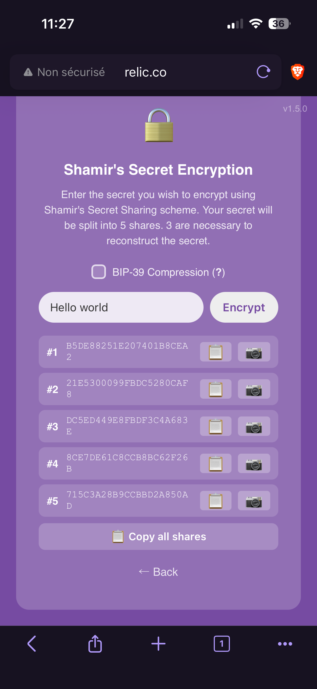
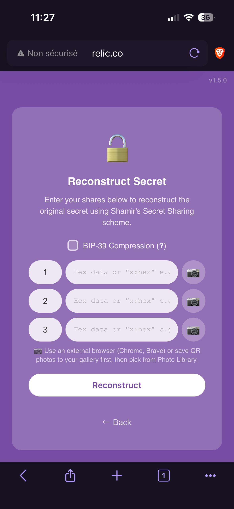

 
 
 

# R.E.L.I.C
<i>Recovery and Encryption via Lagrange Interpolated Components</i>

 

Relic Core is a firmware for ESP32 boards that implements Shamir's Secret Sharing algorithm to split and recover secrets (like passwords, private keys, bitcoin seed phrases etc.) in a secure way.

See the [demo](https://ficaud.github.io/relic-core/) in a WASM type web page hosted by github to see how it works.

See the [full doc](https://ficaud.github.io/relic-hw/) to learn more about the general concepts of Relic Core and how to build it yourself in full autonomous.

## Features

- **Fully offline & self-hosted** — Runs on budget, widely available ESP32 hardware with no internet connection required. The device creates its own Wi-Fi access point and serves everything locally.
- Implements Shamir's Secret Sharing over GF(2⁸) with a 3-of-5 threshold scheme. The secret is split into 5 shares, any 3 of which are required to reconstruct it. Secrets never leave the device during split/recovery via the embedded web UI.
- **Friendly web interface** — A captive-portal web app lets you split secrets and recover them with zero technical knowledge.
- **QR code support** — Generate scannable QR codes for each share on the split page, and scan shares back using your camera (or a file picker on mobile) to reconstruct the secret on the unsplit page.
- **Easy flashing** — A browser-based web flasher (Chrome/Edge) flashes the firmware over USB without any technical setup, and even generates a QR code to auto-join the device's Wi-Fi network afterward.
- **Open source & free** — Licensed under GPL 3.0, with an open development process and publicly available documentation.

## Dependencies

The firmware is built on the following C libraries:

| Library | Version | Used for | Source |
|---|---|---|---|
| [Zephyr RTOS](https://github.com/zephyrproject-rtos/zephyr) | v4.4.2 | RTOS kernel, networking, Wi-Fi, logging, RNG. Its modules (`hal_espressif`, `mbedtls`, `tf-psa-crypto`, `zcbor`, `picolibc`, `mcuboot`) are fetched via `west update` — see `west.yml`. | `west.yml` |
| [quirc](https://github.com/ficaud/relic-quirc) (relic-quirc fork) | v1.2 | On-device QR decoding (`src/qrcode/qr_decode.c`, ESP32-S3 only via `CONFIG_RELIC_QR_DECODE_SERVER`) | git submodule `external/quirc` |
| [Nayuki QR-Code-generator](https://github.com/nayuki/QR-Code-generator) | — | QR generation (`src/qrcode/qr_encode.c`, reduced build: alphanumeric / ECC LOW only, MIT) | vendored in `src/qrcode/qr_encode.c` |

Zephyr module versions are pinned by the Zephyr v4.4.2 manifest and resolved with `west update`. `external/sss` (dsprenkels/sss) is not a firmware dependency — it is used only to cross-validate the unit tests.

## How to flash the firmware

1. Open the **[web flasher](https://ficaud.github.io/relic-core/flash.html)** in Chrome or Edge.
2. Connect your ESP32 board via USB.
3. Put the board in **download mode**:
   - Hold **BOOT**, tap **RESET**, release **BOOT**.
4. Click **Connect & Flash**, select the serial port when prompted.
5. Wait for the progress bar to complete — done!

## How to connect to captive portal

Once the ESP32 is loaded with the firmware, it will create a Wi-Fi access point named `Relic-XXXX`, where `XXXX` is the first 4 characters of the ESP32 MAC address.

You can then join the network in one of two ways:

1. **Scan the QR code** shown after flashing the firmware to join the network automatically (note that you must reboot the device before doing so).

 
 
 

2. **Manually connect** by searching for the SSID `Relic-XXXX` on your router and connecting with the password derived from your device's MAC address (also shown on below the SSID after flashing the device).

## SSS settings

The current implementation uses GF(2^8) finite fields and the Shamir's Secret Sharing algorithm with a threshold of 3 for 5 shares generated.

Maybe in the future, we will be able to set the threshold dynamically. That's not the was right now.

You also have the possibility to generate QR codes with the shares (in the split page), and scan QR codes back to reconstruct the secret in the unpsplit page.

&nbsp;&nbsp;&nbsp;&nbsp;&nbsp;&nbsp;&nbsp;&nbsp;&nbsp;&nbsp;&nbsp;&nbsp;&nbsp;&nbsp;&nbsp;&nbsp;

## Docker

The WASM demo (the same web UI as the ESP32 captive portal, but running 100% client-side in the browser) is packaged as a Docker image. It works on any platform: **Linux**, **macOS**, **Windows**, and **Raspberry Pi** (arm64 / arm/v7).

Please refer to the [relic-core docker doc](doc/docker.md) for more information.

## Contribution

In [CONTRIBUTING](CONTRIBUTING.md), you'll find all the required information to contribute to the project. Please also read the [code of conduct](CODE_OF_CONDUCT.md) and the [vulnerability](SECURITY.md) policy.

## License

Relic Core is licensed under the [GNU General Public License v3.0](LICENSE) (`GPL-3.0-or-later`).
